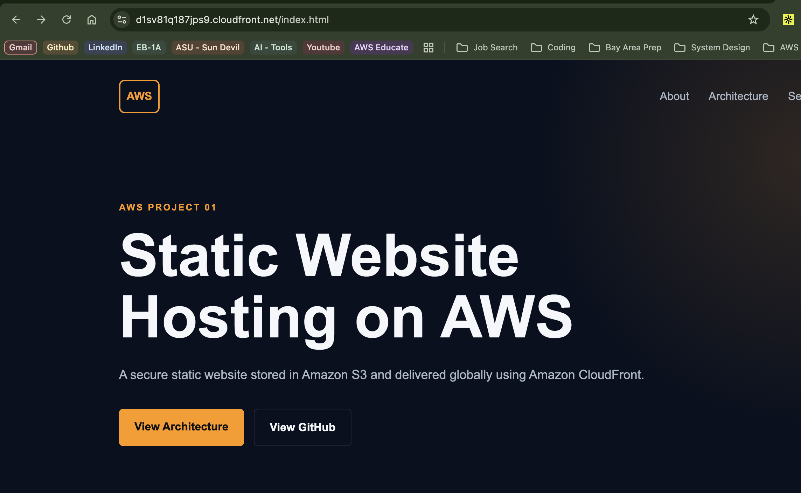
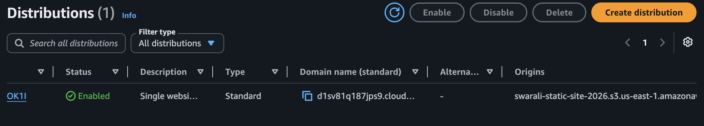
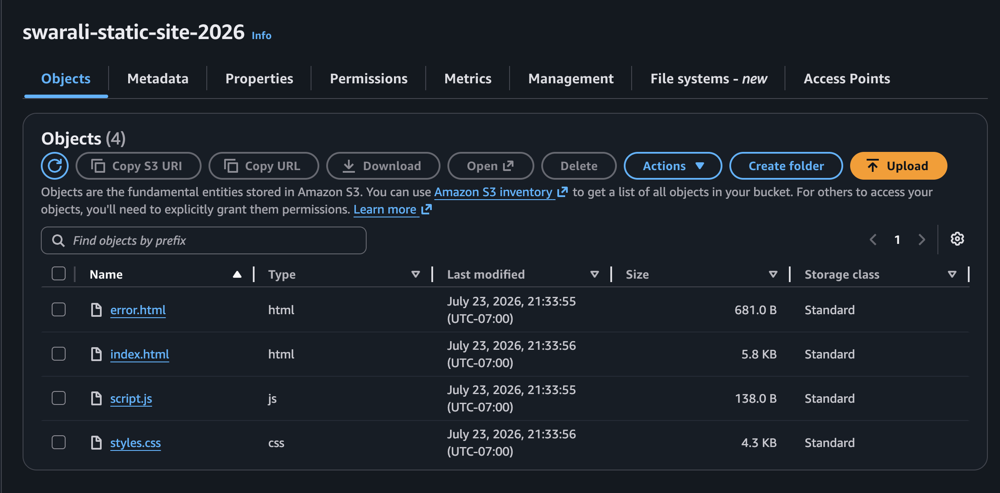
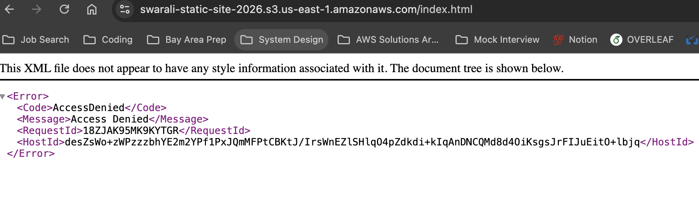

# 🚀 Secure Static Website Hosting with Amazon S3 and CloudFront

## ☁️ AWS Projects Portfolio

This project is part of my **AWS Projects Portfolio**, where I am building **80+ hands-on AWS projects** covering Cloud Architecture, Networking, Security, DevOps, Containers, Serverless, AI/ML, Monitoring, and Infrastructure Automation.

Each project is designed to demonstrate real-world cloud engineering skills using AWS best practices.

**Portfolio Repository**

➡️ https://github.com/swaralichine/aws-projects

---

# 🌐 Live Demo

**Website**

https://d1sv81q187jps9.cloudfront.net

---

# 📌 Project Overview

This project demonstrates how to securely host a static website using **Amazon S3**, **Amazon CloudFront**, and **Origin Access Control (OAC)**.

Instead of making the S3 bucket public, the website is delivered through CloudFront while the S3 bucket remains completely private. This architecture follows AWS security best practices and provides HTTPS, global content delivery, and edge caching.

---

# 🎯 Project Objectives

- Deploy a static website on AWS
- Keep the Amazon S3 bucket private
- Secure website access through CloudFront
- Enable HTTPS
- Learn CloudFront caching
- Implement Origin Access Control (OAC)
- Understand production-grade AWS architecture

---

# 🏗️ Architecture

```
                    Internet
                         │
                         ▼
               Amazon CloudFront
          HTTPS • CDN • Edge Caching
                         │
                         ▼
          Origin Access Control (OAC)
                         │
                         ▼
             Private Amazon S3 Bucket
                         │
                         ▼
        index.html • styles.css • script.js
```

---

# 🔄 Architecture Flow

```
User
   │
   ▼
CloudFront
   │
Checks Edge Cache
   │
 ┌───────────────┐
 │ Cache Hit     │────────► Return Website
 └───────────────┘
        │
        ▼
 Cache Miss
        │
        ▼
Origin Access Control
        │
        ▼
Private Amazon S3
        │
        ▼
Website Files
```

---

# 🔄 Request Flow

1. User enters the CloudFront URL.
2. CloudFront receives the HTTPS request.
3. CloudFront checks the nearest edge cache.
4. If cached, CloudFront immediately returns the website.
5. Otherwise, CloudFront securely requests the object from Amazon S3 using Origin Access Control.
6. Amazon S3 validates the request.
7. S3 returns the requested object.
8. CloudFront caches the object and serves it to the user.

---

# ☁️ AWS Services Used

| AWS Service | Purpose |
|-------------|---------|
| Amazon S3 | Stores static website files |
| Amazon CloudFront | Global CDN and HTTPS |
| Origin Access Control | Secure CloudFront access to S3 |
| IAM Policy | Restricts S3 access |

---

# 🛠️ Skills Demonstrated

- Amazon S3
- Amazon CloudFront
- CDN
- HTTPS
- Origin Access Control (OAC)
- IAM Policies
- Static Website Hosting
- Edge Caching
- Cloud Security
- Least Privilege
- AWS Architecture
- AWS Console
- Cloud Deployment

---

# 📁 Project Structure

```
01-static-website-s3-cloudfront/
│
├── README.md
├── architecture.md
├── cleanup.md
├── cost-estimate.md
├── index.html
├── styles.css
├── script.js
├── error.html
├── infrastructure/
│     └── architecture.png
└── screenshots/
      ├── 01-cloudfront-website.png
      ├── 02-cloudfront-distribution.png
      ├── 03-s3-objects.png
      └── 04-s3-private-access-denied.png
```

---

# 📸 Screenshots

## Website Hosted Through CloudFront



---

## CloudFront Distribution



---

## Amazon S3 Bucket



---

## Private S3 Validation

Attempting to access the S3 Object URL directly returns **Access Denied**, confirming that the bucket is private and only CloudFront can retrieve objects.



---

# 🔐 Security Features

This implementation follows AWS security best practices.

Implemented controls:

- Private Amazon S3 Bucket
- S3 Block Public Access
- Origin Access Control (OAC)
- HTTPS
- HTTP → HTTPS Redirect
- Least Privilege Access
- Secure CloudFront Origin
- Direct S3 Access Blocked

---

# 🚀 Deployment Steps

## Step 1

Create an Amazon S3 bucket.

Configuration:

- Region: us-east-1
- Bucket Name: swarali-static-site-2026
- Block Public Access Enabled

---

## Step 2

Upload:

- index.html
- styles.css
- script.js
- error.html

---

## Step 3

Create the CloudFront Distribution.

Configuration:

- Origin: Amazon S3
- Origin Access Control
- HTTPS
- Default Root Object: index.html
- CloudFront Default Certificate

---

## Step 4

Validate deployment.

Verified:

- Website loads successfully
- HTTPS enabled
- CloudFront serves website
- Root URL loads index.html
- S3 Object URL returns Access Denied

---

# 💰 Cost Estimate

Resources:

- Amazon S3
- Amazon CloudFront

Estimated monthly cost:

**$0.00–$0.05** for personal testing.

---

# 🎯 Project Outcomes

Successfully:

- Built a secure static website architecture
- Configured CloudFront with Origin Access Control
- Kept Amazon S3 private
- Enabled HTTPS
- Learned CDN caching
- Implemented AWS security best practices
- Understood browser → CloudFront → S3 communication

---

# 📚 Key Learnings

This project helped reinforce:

- Static website hosting
- Amazon CloudFront
- Amazon S3
- CDN architecture
- HTTPS
- Origin Access Control
- Edge caching
- AWS Security Best Practices
- Least Privilege
- Cloud Architecture

---


# 🧹 Cleanup

1. Disable CloudFront
2. Delete CloudFront
3. Empty S3 Bucket
4. Delete S3 Bucket
5. Verify AWS Billing

Detailed instructions are available in **cleanup.md**.

---

# 👩‍💻 About Me

## Swarali Chine

Cloud Engineer with a passion for AWS, Cloud Security, DevOps, and AI-powered Cloud Engineering.

Currently building **80+ AWS projects** to deepen expertise in cloud architecture and distributed systems.

- AWS Certified
- Cloud Engineering
- DevOps
- Security
- AI on AWS

---

## ⭐ Support

If you found this project helpful, consider giving the repository a ⭐.