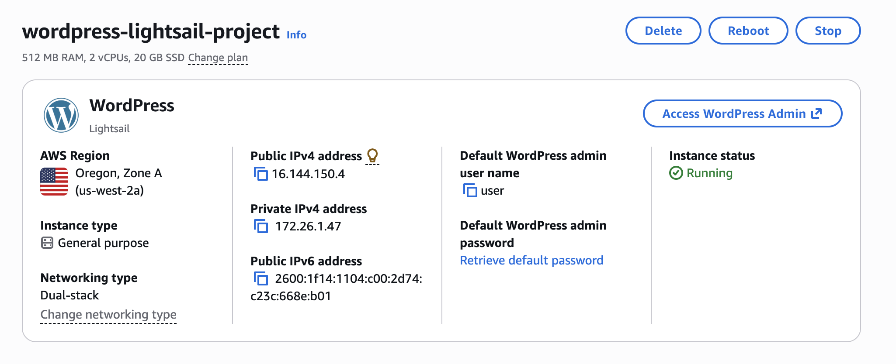
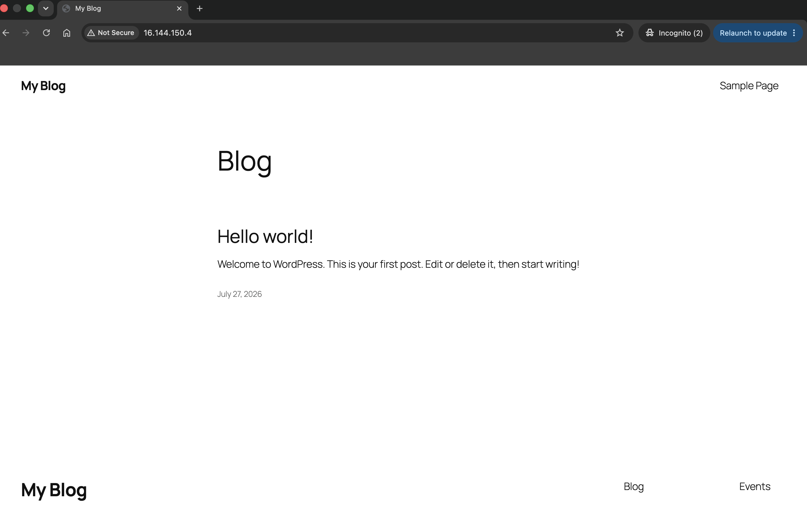
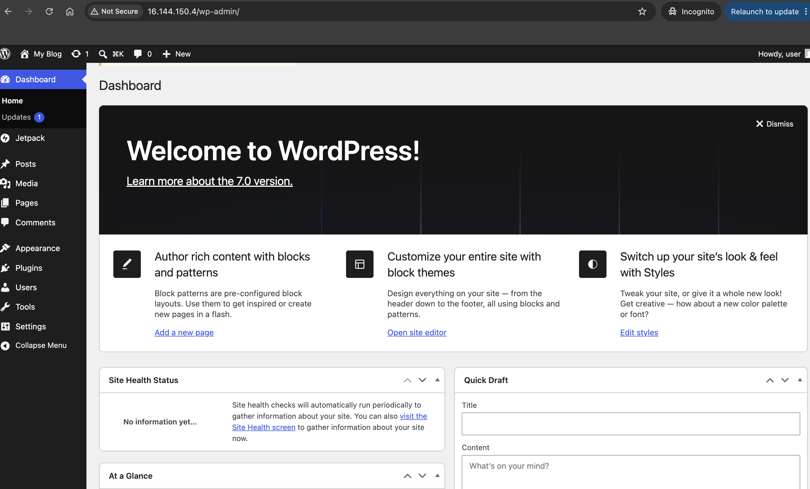
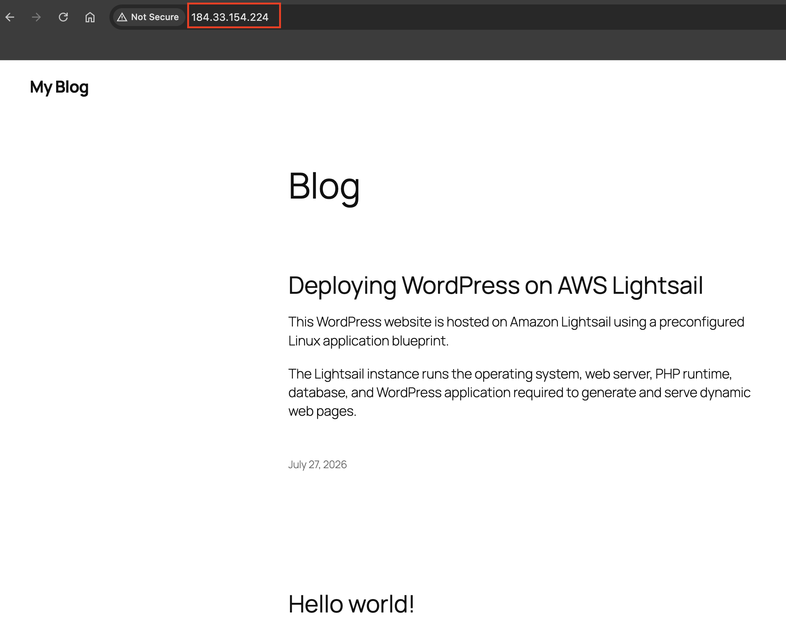
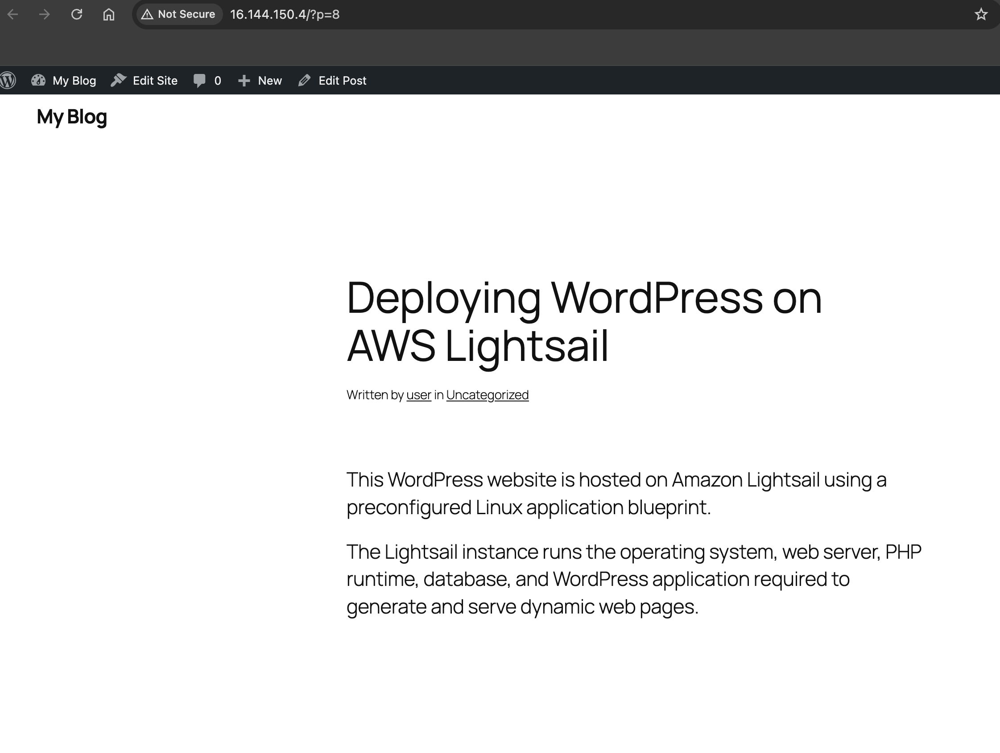
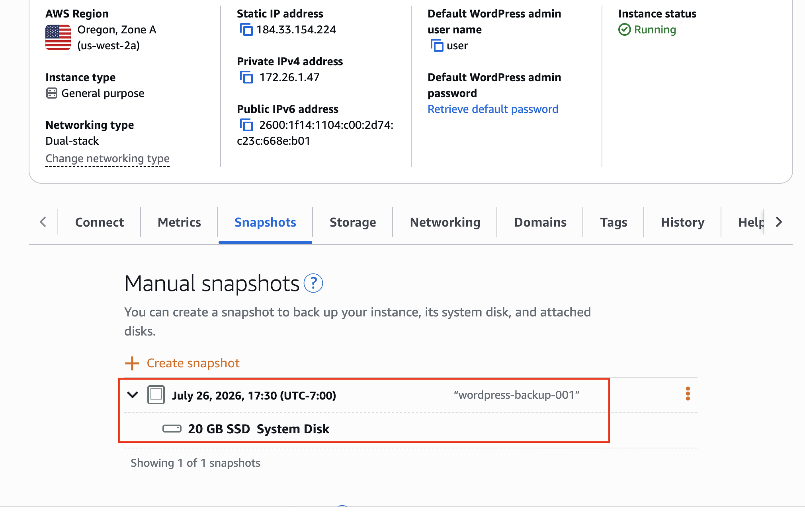

# Deploy a WordPress Blog on AWS Lightsail

## Project Overview

This project demonstrates how to deploy a fully functional WordPress website using Amazon Lightsail. Instead of manually configuring a Linux server, web server, PHP runtime, and database, Amazon Lightsail provides a preconfigured WordPress blueprint that allows a production-ready blogging platform to be deployed within minutes.

The project covers launching a virtual private server, accessing the WordPress administration dashboard, publishing content, configuring a Static IP, and creating instance snapshots for backup and disaster recovery.

---

## Objectives

- Deploy a WordPress website on Amazon Lightsail
- Understand how WordPress runs as a web application
- Learn the architecture of a LAMP-based application stack
- Configure a Static IP for a stable public endpoint
- Create a backup snapshot of the server
- Understand compute, networking, and backup concepts in AWS

---
## Deployment Steps

1. Created an Amazon Lightsail WordPress instance.
2. Retrieved the default administrator password.
3. Logged into the WordPress Admin Dashboard.
4. Published the first blog post.
5. Attached a Static IP to the instance.
6. Created a Lightsail Snapshot for backup and recovery.

---

## Architecture

```
                Internet
                     │
                     ▼
            Static Public IP
                     │
                     ▼
        Amazon Lightsail Instance
     ┌────────────────────────────┐
     │ Ubuntu Linux               │
     │ Apache Web Server          │
     │ PHP Runtime                │
     │ MariaDB Database           │
     │ WordPress Application      │
     └────────────────────────────┘
                     │
                     ▼
             Lightsail Snapshot
```

---

## Request Flow

1. User accesses the website using the Static IP.
2. Apache receives the HTTP request.
3. PHP executes the WordPress application.
4. WordPress retrieves data from the MariaDB database.
5. WordPress dynamically generates HTML.
6. The generated webpage is returned to the user's browser.

---

## AWS Services Used

| Service | Purpose |
|----------|---------|
| Amazon Lightsail | Hosts the WordPress application |
| Static IP | Provides a permanent public endpoint |
| Lightsail Snapshot | Creates a backup of the server |

---

## Skills Demonstrated

- Virtual Server Deployment
- WordPress Administration
- Linux-based Web Hosting
- Static IP Configuration
- Snapshot Backups
- Web Application Hosting
- Cloud Infrastructure Fundamentals

---

## Project Structure

```
02-wordpress-aws-lightsail/
│
├── README.md
├── architecture.md
├── cleanup.md
├── cost-estimate.md
└── screenshots/
```

---

## Screenshots

### 1. Amazon Lightsail Instance

The WordPress instance successfully deployed and running on Amazon Lightsail.



---

### 2. WordPress Homepage

The default WordPress website accessible through the assigned Static IP.



---

### 3. WordPress Admin Dashboard

Logged into the WordPress administration panel to manage the website.



---

### 4. Static IP Configuration

A Static IP attached to the Lightsail instance to provide a permanent public endpoint.



---

### 5. Published Blog Post

Successfully published the first blog post using the WordPress editor.



---

### 6. Lightsail Snapshot

Created a snapshot to back up the entire server for disaster recovery.



---

## Security

- WordPress deployed using the managed Lightsail blueprint
- Static IP provides a stable endpoint for DNS integration
- Administrative access protected using WordPress credentials
- Snapshot created for backup and recovery

---

## Deployment Summary

- Created a Lightsail WordPress instance
- Logged into the WordPress dashboard
- Published a sample blog post
- Attached a Static IP
- Created a snapshot for disaster recovery

---

## Cost Estimate

| Resource | Estimated Cost |
|-----------|---------------:|
| Lightsail Instance | ~$5/month (prorated while running) |
| Static IP | Included while attached |
| Snapshot | Small storage charge while retained |

---

## Key Learnings

- WordPress is a dynamic web application that requires compute resources.
- Amazon Lightsail simplifies server deployment by providing preconfigured application blueprints.
- Static IPs provide permanent network endpoints for production workloads.
- Snapshots enable rapid recovery from accidental deletion or system failures.

---

## Cleanup

After completing the project:

- Delete the Lightsail instance
- Release the Static IP
- Delete the Lightsail snapshot

This prevents ongoing AWS charges.

---

## About Me

- GitHub: https://github.com/swaralichine
- Portfolio: https://swaralichine.github.io
- LinkedIn: https://www.linkedin.com/in/swaralichine