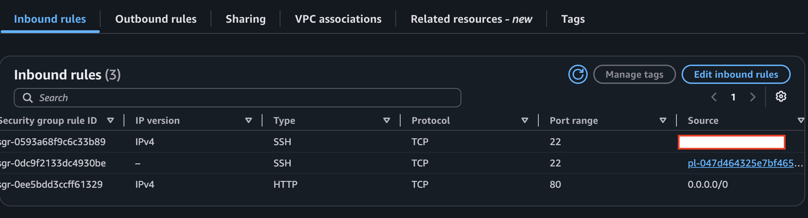
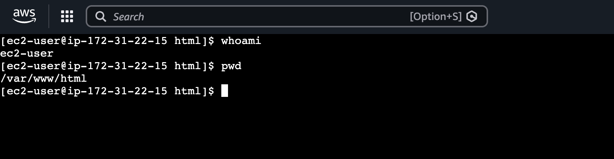
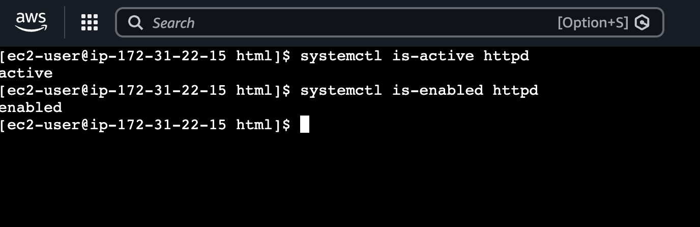
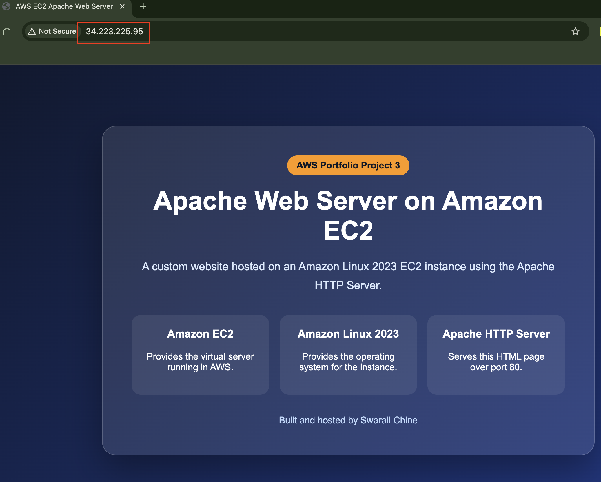
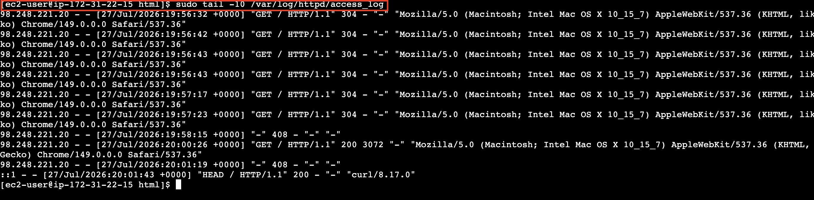
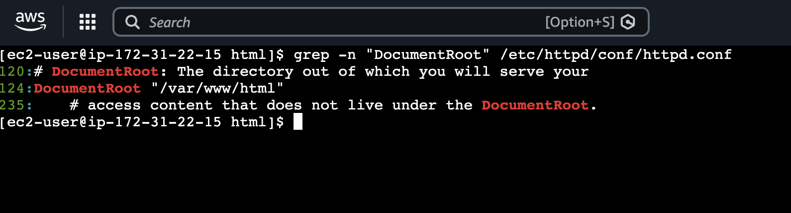
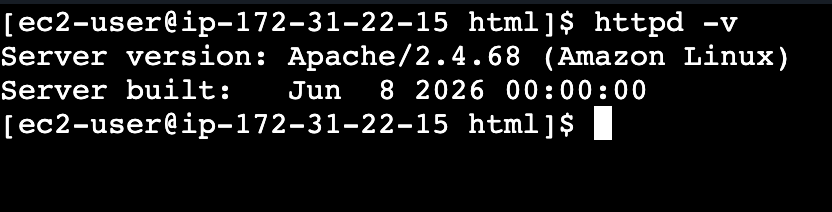

# Configure an Apache Web Server on Amazon EC2

Deploy a custom website on an Amazon EC2 instance by installing and configuring the Apache HTTP Server on Amazon Linux 2023. This project demonstrates the fundamentals of AWS compute, Linux administration, networking, and web hosting while following AWS security best practices.

---

## Project Overview

In this project, I launched an Amazon EC2 instance, configured networking and security, installed the Apache HTTP Server, and deployed a custom HTML website. Instead of using a managed hosting service, I manually configured the web server to better understand how applications are hosted in cloud environments.

This project provides hands-on experience with:

- Amazon EC2
- Amazon Linux 2023
- Apache HTTP Server
- Security Groups
- Amazon EBS
- Linux Administration
- SSH
- Basic Web Hosting

---

## Architecture

```
                Internet
                    │
                    ▼
             Security Group
        ┌────────────────────────┐
        │ HTTP (80)              │
        │ SSH (22 - My IP)       │
        └────────────────────────┘
                    │
                    ▼
          Amazon EC2 Instance
      ┌──────────────────────────┐
      │ Amazon Linux 2023        │
      │ Apache HTTP Server       │
      │ index.html               │
      └──────────────────────────┘
                    │
                    ▼
             Amazon EBS Volume
```

For a detailed explanation, see [architecture.md](architecture.md).

---

## AWS Services Used

| Service | Purpose |
|----------|---------|
| Amazon EC2 | Virtual machine hosting the web server |
| Amazon Linux 2023 | Operating system |
| Apache HTTP Server | Web server |
| Security Groups | Firewall controlling inbound traffic |
| Amazon EBS | Persistent storage for the EC2 instance |

---

## Implementation Steps

### 1. Launch Amazon EC2

- Created an EC2 instance using Amazon Linux 2023
- Selected a micro instance type
- Created a new SSH key pair
- Configured networking

---

### 2. Configure Security

Configured inbound rules:

- SSH (22) → My IP
- HTTP (80) → Anywhere (0.0.0.0/0)

This allows secure administration while making the website publicly accessible.

---

### 3. Connect to Linux

Connected using EC2 Instance Connect and verified the environment using:

```bash
whoami
cat /etc/os-release
pwd
```

---

### 4. Install Apache

Updated the operating system and installed Apache:

```bash
sudo dnf update -y
sudo dnf install httpd -y
```

Started and enabled the Apache service:

```bash
sudo systemctl start httpd
sudo systemctl enable httpd
```

---

### 5. Deploy Website

Created a custom `index.html` page inside:

```
/var/www/html
```

Restarted Apache:

```bash
sudo systemctl restart httpd
```

Verified the website using the EC2 public IPv4 address.

---

### 6. Verify Server

Validated Apache configuration using:

- DocumentRoot
- Apache status
- Access logs
- Error logs
- curl

Example commands:

```bash
grep -n "DocumentRoot" /etc/httpd/conf/httpd.conf

sudo tail -10 /var/log/httpd/access_log

curl -I http://localhost
```

---

## Screenshots

### EC2 Instance


---

### Security Group



---

### Linux Terminal



---

### Apache Running



---

### Hosted Website



---

### Apache Access Logs



---

### Apache Document Root



---

### Apache Installation



---

## Key Learnings

Through this project, I gained hands-on experience with:

- Launching and managing Amazon EC2 instances
- Configuring Security Groups
- Connecting to Linux servers
- Installing and managing Apache
- Hosting static websites
- Understanding Apache configuration files
- Monitoring Apache logs
- Troubleshooting web server deployments
- Managing AWS infrastructure costs through proper resource cleanup

---

## Cost Optimization

This project was designed to minimize AWS costs by:

- Using a micro EC2 instance
- Using the default root EBS volume
- Avoiding Elastic IP allocation
- Terminating all AWS resources immediately after completing the project

See **cost-estimate.md** for more details.

---

## Cleanup

After completing the project:

- Terminated the EC2 instance
- Verified deletion of the EBS root volume
- Confirmed no Elastic IP addresses remained
- Removed the custom Security Group

Detailed cleanup instructions are available in **cleanup.md**.

---

## Repository Structure

```
03-ec2-apache-web-server/
│
├── README.md
├── architecture.md
├── cost-estimate.md
├── cleanup.md
├── index.html
└── screenshots/
```

---

## References

- Amazon EC2 Documentation
- Amazon Linux 2023 Documentation
- Apache HTTP Server Documentation
- AWS Security Groups Documentation