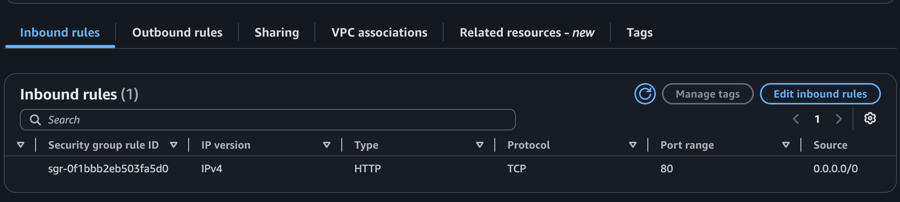
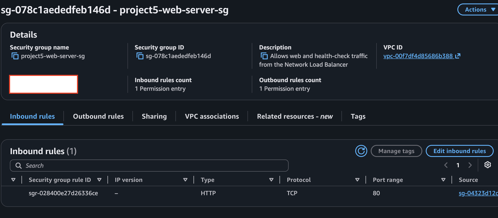
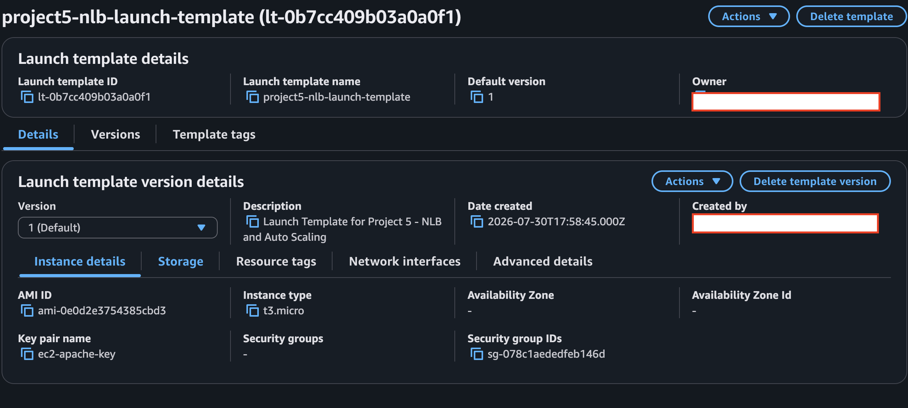
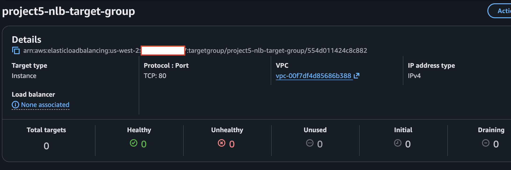
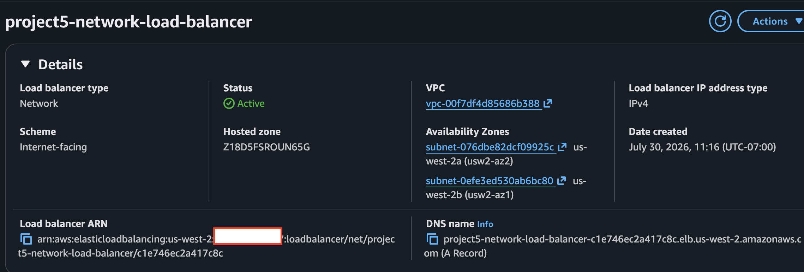
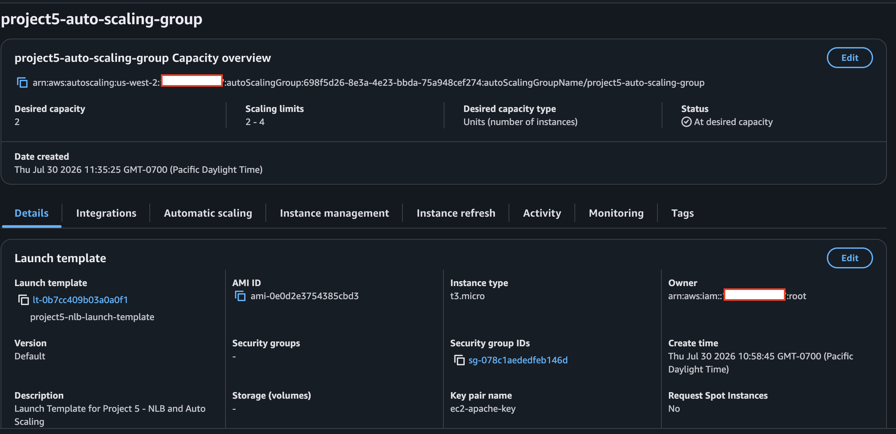
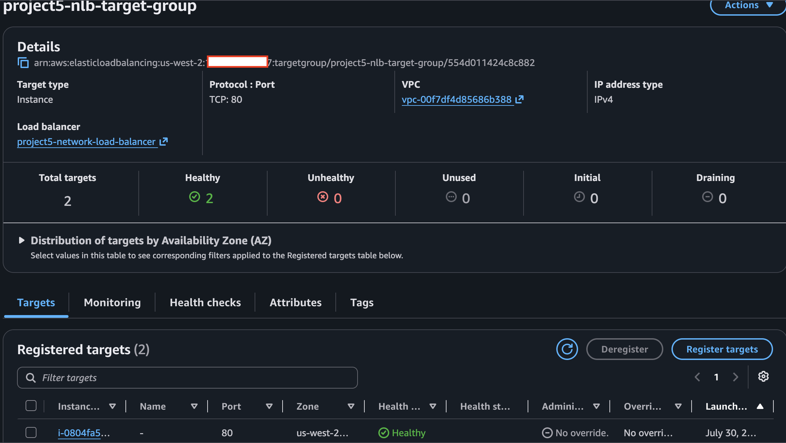
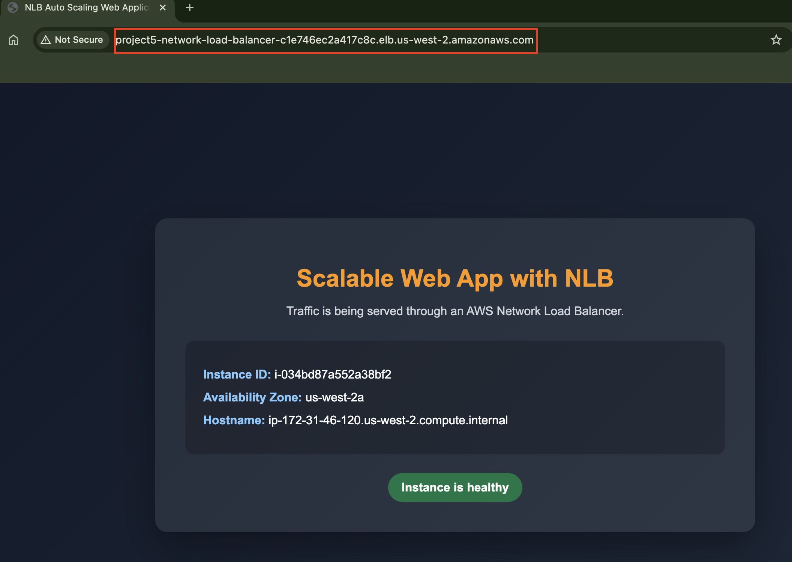

# Scalable Web Application with NLB and Auto Scaling

## Project Overview

This project deploys a highly available Apache web application using an AWS Network Load Balancer (NLB), EC2 Auto Scaling, a Launch Template, and a TCP target group.

The NLB accepts public TCP traffic on port 80 and distributes connections across healthy EC2 instances in two Availability Zones. The Auto Scaling Group maintains capacity, replaces unhealthy instances, and can scale between the configured minimum and maximum capacity.

## Architecture

```text
                              Internet
                                  |
                                  v
                    Network Load Balancer
                    TCP listener on port 80
                                  |
                                  v
                       TCP Target Group
                     HTTP health check on /
                                  |
                    +-------------+-------------+
                    |                           |
                    v                           v
            EC2 Instance — AZ A         EC2 Instance — AZ B
              Apache Web Server           Apache Web Server
                    ^                           ^
                    +-------------+-------------+
                                  |
                         Auto Scaling Group
                         Min: 2 | Desired: 2
                              Max: 4
                                  |
                                  v
                          Launch Template
                 AMI + instance type + SG + user data
```

See [architecture.md](architecture.md) for the full design explanation.

## AWS Services Used

| Service | Purpose |
|---|---|
| Amazon EC2 | Runs the Apache web servers |
| Launch Template | Defines the configuration used to launch identical instances |
| EC2 Auto Scaling | Maintains capacity, replaces failed instances, and scales dynamically |
| Network Load Balancer | Accepts public Layer 4 traffic and distributes TCP connections |
| Target Group | Registers EC2 instances and performs health checks |
| Security Groups | Controls access to the NLB and EC2 instances |
| Amazon EBS | Provides EC2 root storage |
| Amazon CloudWatch | Supplies CPU metrics for target tracking |

## Configuration Summary

| Component | Configuration |
|---|---|
| NLB scheme | Internet-facing |
| NLB listener | TCP on port 80 |
| Target type | Instances |
| Target group protocol | TCP on port 80 |
| Health check | HTTP on `/` |
| Operating system | Amazon Linux 2023 |
| Instance type | `t2.micro` |
| Web server | Apache HTTP Server |
| Auto Scaling capacity | Minimum 2, desired 2, maximum 4 |
| Scaling policy | Target tracking at 50% average CPU |
| Placement | Two public subnets in two Availability Zones |

## Security Design

### NLB security group

- Allows inbound port 80 from `0.0.0.0/0`.
- Allows outbound traffic to registered targets.

### EC2 web server security group

- Allows port 80 only from the NLB security group.
- Optionally allows SSH from a trusted administrator IP.
- Prevents users from bypassing the NLB and directly accessing the web servers.

## Deployment Workflow

1. Create the NLB and EC2 security groups.
2. Create a Launch Template using Amazon Linux 2023, `t2.micro`, the EC2 security group, and user data.
3. Create an instance target group using TCP on port 80.
4. Configure HTTP health checks on `/`.
5. Create an internet-facing NLB in two public subnets.
6. Add a TCP listener on port 80 and forward it to the target group.
7. Create an Auto Scaling Group from the Launch Template.
8. Attach the Auto Scaling Group to the target group.
9. Configure minimum 2, desired 2, and maximum 4 instances.
10. Enable ELB health checks with a 300-second grace period.
11. Add target tracking at 50% average CPU.
12. Open the NLB DNS name and verify the application.

## Validation

The deployment is successful when:

- The NLB status is `Active`.
- The Auto Scaling Group has two healthy instances.
- The target group reports two healthy targets.
- The NLB DNS name loads the application.
- Repeated connections can be served by different backend instances.

## Screenshots

















> Rename or remove image references that do not match your actual screenshot filenames.

## Repository Structure

```text
05-scalable-web-app-nlb-autoscaling/
├── README.md
├── architecture.md
├── cleanup.md
├── cost-estimate.md
├── user-data.sh
└── screenshots/
    ├── 01-nlb-security-group.png
    ├── 02-web-server-security-group.png
    ├── 03-launch-template.png
    ├── 04-target-group.png
    ├── 05-network-load-balancer.png
    ├── 06-auto-scaling-group.png
    ├── 07-target-group-healthy.png
    └── 08-web-application.png
```

## Cleanup

Delete the deployment after testing to stop ongoing charges. Follow [cleanup.md](cleanup.md).

## Cost

The NLB, EC2 instances, EBS volumes, public IPv4 addresses, and data transfer can generate charges. See [cost-estimate.md](cost-estimate.md).
