# Multi-Tier Web Application Deployment on AWS

Deploy a secure and highly available multi-tier web application on AWS using a custom VPC, Application Load Balancer, EC2 Auto Scaling, and Amazon RDS for MySQL.

This project demonstrates how networking, compute, load balancing, security, and database services work together in a production-inspired architecture.

---

## Project Overview

A single-server deployment creates a single point of failure and does not provide proper separation between the web and database layers.

In this project, I built a multi-tier architecture with:

- A custom Amazon VPC
- Two public subnets across two Availability Zones
- Two private database subnets
- An internet-facing Application Load Balancer
- EC2 web servers managed by an Auto Scaling Group
- Amazon RDS for MySQL in private subnets
- Separate security groups for the ALB, EC2, and RDS layers
- Automated server configuration using EC2 User Data

The final request flow is:

```text
User
  |
  v
Application Load Balancer
  |
  v
EC2 Web Servers
  |
  v
Amazon RDS MySQL
```

---

## Architecture

```text
                              Internet
                                  |
                                  v
                         Internet Gateway
                                  |
                                  v
                  Application Load Balancer
                Public Subnet A + Public Subnet B
                                  |
                                  v
                           Target Group
                                  |
                    +-------------+-------------+
                    |                           |
                    v                           v
             EC2 Web Server 1           EC2 Web Server 2
              Public Subnet A             Public Subnet B
                    |                           |
                    +-------------+-------------+
                                  |
                                  v
                         Amazon RDS MySQL
                 Private Subnet A + Private Subnet B
```

For a deeper explanation of the design, see [architecture.md](architecture.md).

---

## AWS Services Used

| Service | Purpose |
|---|---|
| Amazon VPC | Provides an isolated network for the application |
| Public Subnets | Host the ALB and EC2 web servers |
| Private Subnets | Host the RDS database without direct internet exposure |
| Internet Gateway | Connects the public subnets to the internet |
| Route Tables | Control traffic routing between the VPC and internet |
| Security Groups | Restrict communication between the application tiers |
| Application Load Balancer | Distributes HTTP traffic across healthy EC2 instances |
| Target Group | Registers EC2 instances and performs health checks |
| Amazon EC2 | Runs the Apache and PHP web application |
| Launch Template | Defines the EC2 instance configuration |
| EC2 Auto Scaling | Maintains instance capacity and replaces unhealthy instances |
| Amazon RDS for MySQL | Stores application data in a managed relational database |
| Amazon EBS | Provides storage for the EC2 instances |
| Amazon CloudWatch | Supplies metrics used by the Auto Scaling policy |

---

## Network Design

The project uses the following address space:

```text
VPC: 10.0.0.0/16
```

Subnets:

```text
Public Subnet 1:  10.0.1.0/24
Public Subnet 2:  10.0.2.0/24
Private Subnet 1: 10.0.3.0/24
Private Subnet 2: 10.0.4.0/24
```

The two public subnets are associated with a route table containing:

```text
10.0.0.0/16 → local
0.0.0.0/0   → Internet Gateway
```

The private database subnets do not have a direct route to the internet.

---

## Security Design

Three security groups are used to enforce tier-to-tier communication.

### ALB Security Group

Inbound:

```text
HTTP 80 from 0.0.0.0/0
```

This allows users on the internet to access the Application Load Balancer.

### EC2 Security Group

Inbound:

```text
HTTP 80 from project6-alb-sg
SSH 22 from My IP — optional
```

This prevents users from directly reaching the web servers.

### RDS Security Group

Inbound:

```text
MySQL/Aurora 3306 from project6-ec2-sg
```

This ensures the database accepts connections only from the EC2 web tier.

The complete security flow is:

```text
Internet
   |
   v
ALB Security Group
   |
   v
EC2 Security Group
   |
   v
RDS Security Group
```

---

## Database Configuration

The Amazon RDS deployment uses:

| Setting | Value |
|---|---|
| Engine | MySQL |
| DB identifier | `project06-mysql-db` |
| Initial database | `multitierdb` |
| Deployment | Single DB instance |
| Public access | No |
| DB subnet group | `project6-db-subnet-group` |
| Security group | `project6-rds-sg` |
| Encryption | Enabled |
| Backup retention | 1 day |
| Deletion protection | Disabled |

The DB subnet group contains two private subnets across two Availability Zones.

---

## EC2 and Auto Scaling Configuration

The Launch Template includes:

- Amazon Linux 2023
- `t2.micro` or `t3.micro`
- 8 GiB gp3 root volume
- `project6-ec2-sg`
- IMDSv2
- User Data for installing Apache, PHP, and MySQL support

The Auto Scaling Group uses:

```text
Minimum capacity: 2
Desired capacity: 2
Maximum capacity: 4
```

Health checks:

```text
EC2
Elastic Load Balancing
Grace period: 300 seconds
```

Scaling policy:

```text
Target tracking
Average CPU utilization
Target value: 50%
```

---

## User Data

The `user-data.sh` script automatically:

- Updates the operating system
- Installs Apache
- Installs PHP and MySQL support
- Starts and enables Apache
- Retrieves EC2 instance metadata using IMDSv2
- Creates a dynamic PHP webpage
- Connects the application to Amazon RDS
- Displays the instance ID, Availability Zone, and hostname
- Confirms whether the database connection succeeded

The GitHub version uses placeholders:

```bash
DB_HOST="YOUR_RDS_ENDPOINT"
DB_PORT="3306"
DB_NAME="multitierdb"
DB_USER="admin"
DB_PASSWORD="YOUR_DATABASE_PASSWORD"
```

Real database credentials should never be committed to GitHub.

---

## Deployment Workflow

1. Create the custom VPC.
2. Create two public subnets.
3. Create two private subnets.
4. Create and attach an Internet Gateway.
5. Create the public route table.
6. Associate both public subnets with the public route table.
7. Create the ALB, EC2, and RDS security groups.
8. Create the RDS DB subnet group.
9. Create the RDS MySQL database.
10. Create the EC2 User Data script.
11. Create the Launch Template.
12. Create the HTTP Target Group.
13. Create the Application Load Balancer.
14. Create the Auto Scaling Group.
15. Attach the Target Group.
16. Configure the CPU target tracking policy.
17. Verify both targets are healthy.
18. Open the ALB DNS name and test the application.
19. Refresh the page to verify load balancing across EC2 instances.

---

## Validation

The project is working correctly when:

- The ALB status is `Active`.
- Two EC2 instances are running.
- Both EC2 status checks pass.
- The Target Group reports two healthy targets.
- The ALB DNS name loads the PHP application.
- The application displays `Successfully connected to Amazon RDS`.
- The backend instance details change during repeated requests.

---

## Screenshots

### VPC

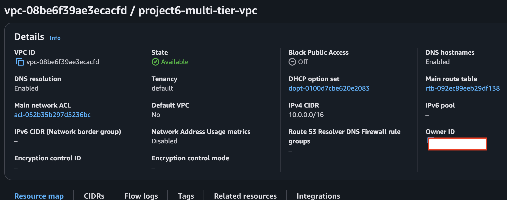

### Public Subnets

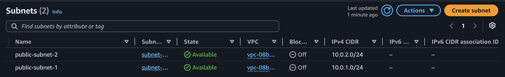

### Private Subnets

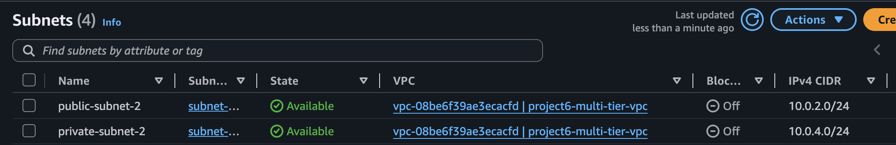

### Internet Gateway

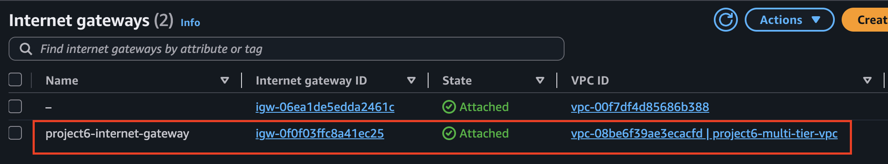

### Public Route Table

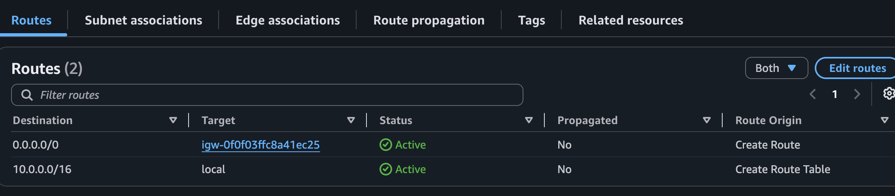

### Public Subnet Associations

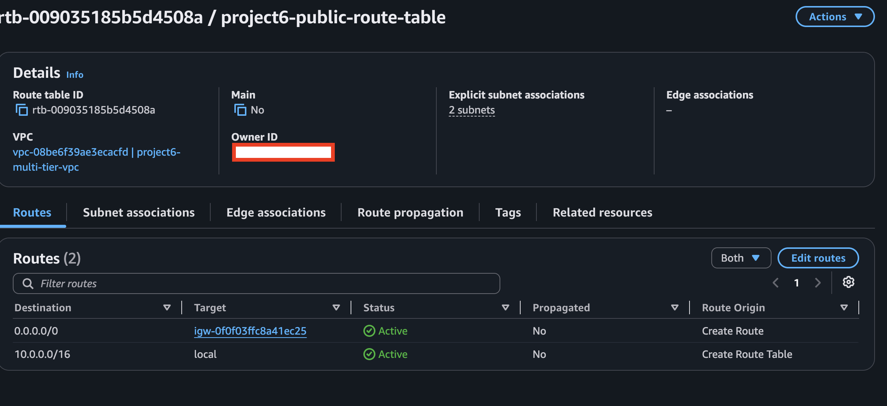

### ALB Security Group

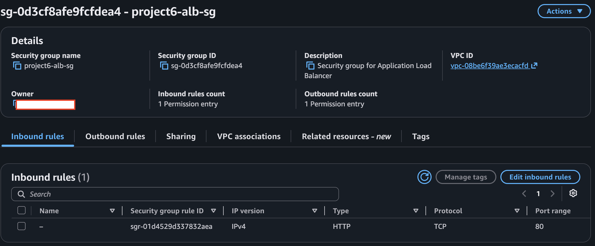

### EC2 Security Group

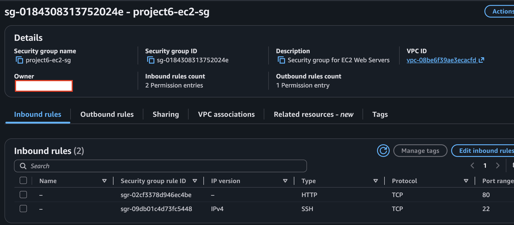

### RDS Security Group

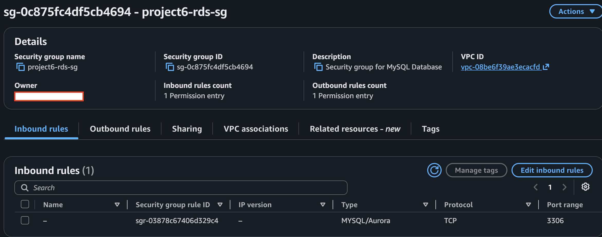

### DB Subnet Group

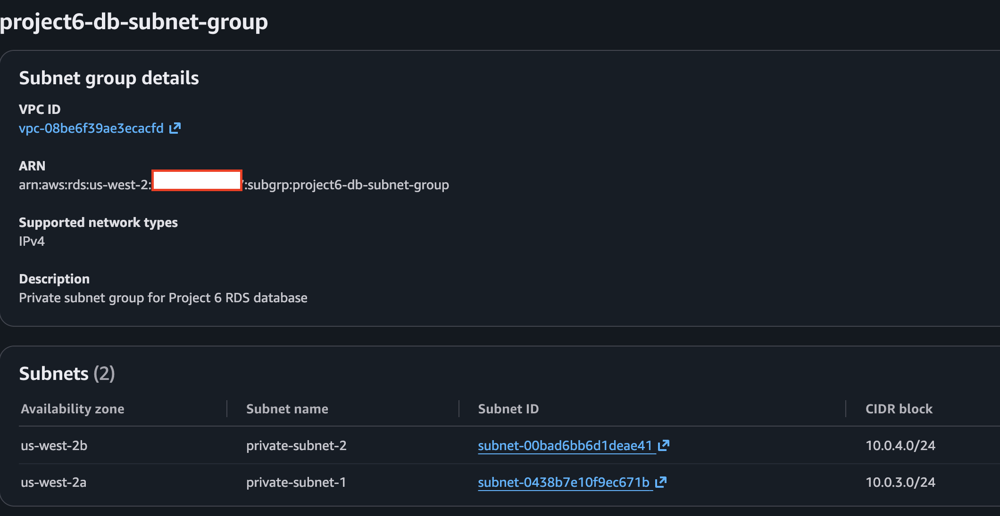

### RDS Database

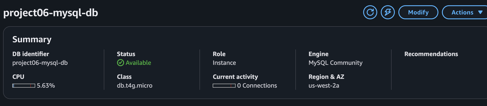

### Launch Template

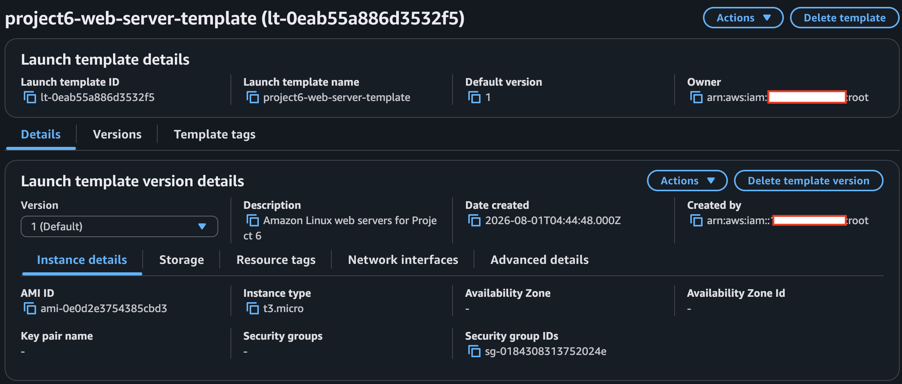

### Target Group

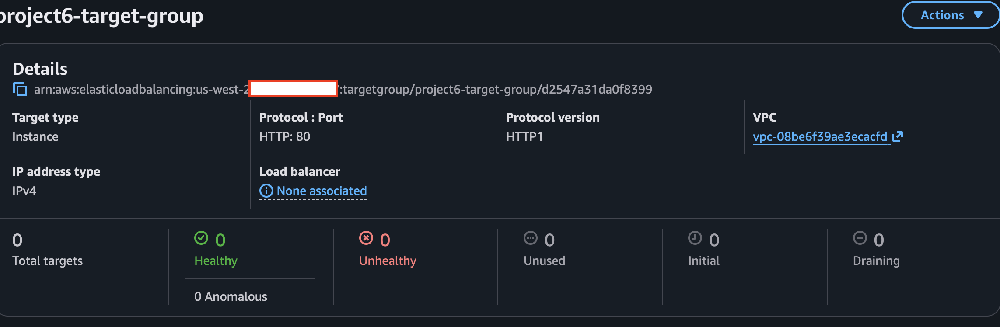

### Application Load Balancer

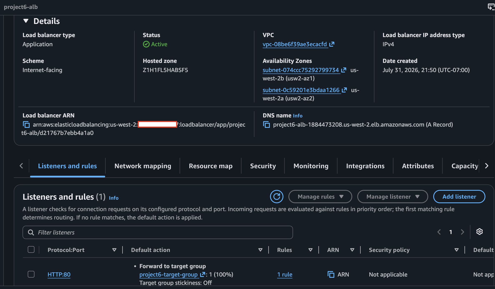

### Auto Scaling Group

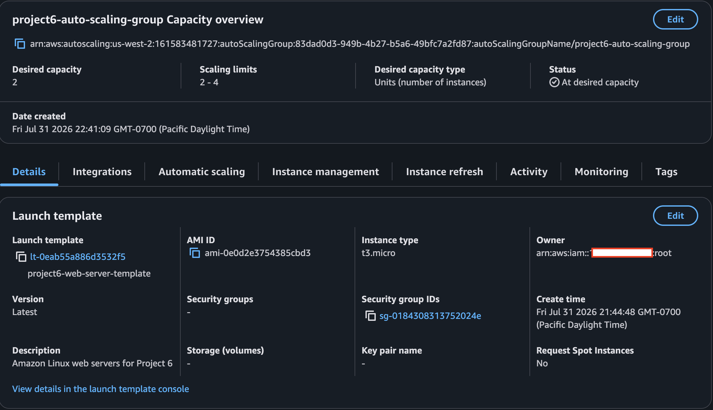

### Healthy Targets

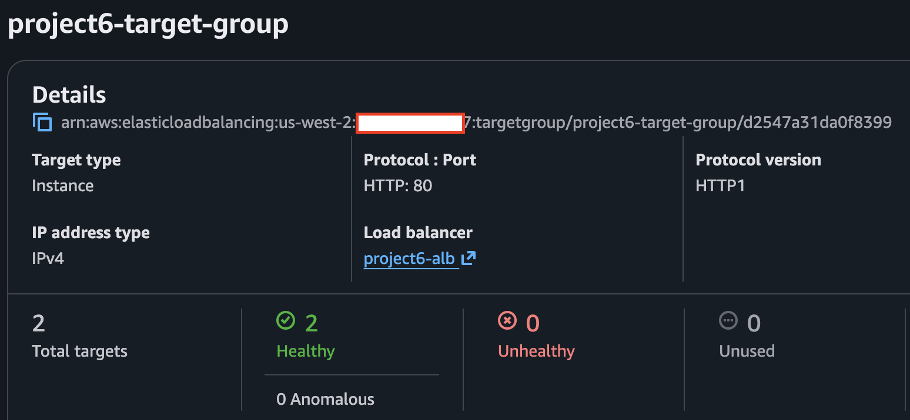

### Multi-Tier Web Application

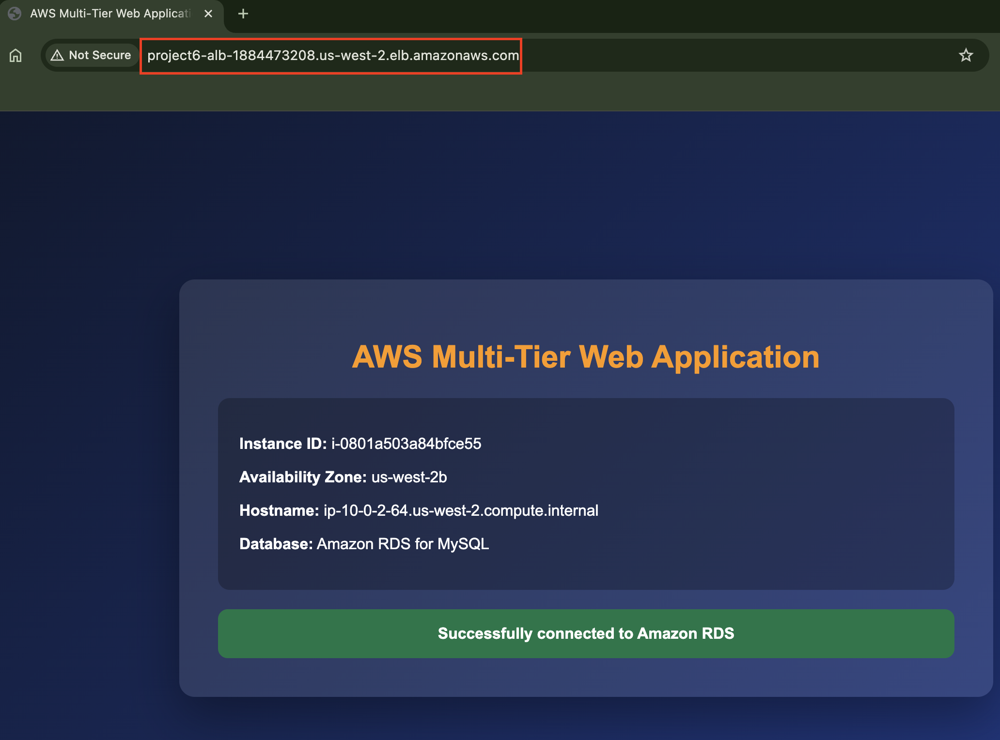

### Load Balancing Test

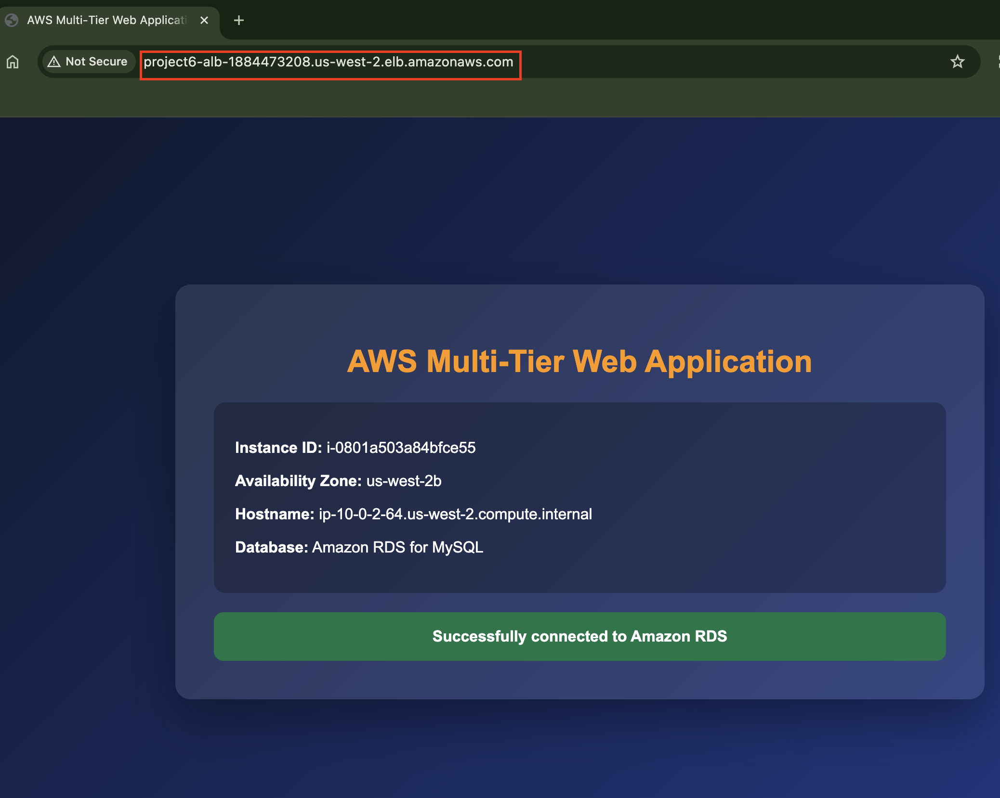

---

## Project Structure

```text
06-multi-tier-web-app-deployment/
├── README.md
├── architecture.md
├── cleanup.md
├── cost-estimate.md
├── user-data.sh
├── diagrams/
└── screenshots/
    ├── 01-vpc.png
    ├── 02-public-subnets.png
    ├── 03-private-subnets.png
    ├── 04-internet-gateway.png
    ├── 05-public-route-table.png
    ├── 06-public-subnet-associations.png
    ├── 07-alb-security-group.png
    ├── 08-ec2-security-group.png
    ├── 09-rds-security-group.png
    ├── 10-db-subnet-group.png
    ├── 11-rds-database.png
    ├── 12-launch-template.png
    ├── 13-target-group.png
    ├── 14-application-load-balancer.png
    ├── 15-auto-scaling-group.png
    ├── 16-target-group-healthy.png
    ├── 17-multi-tier-web-application.png
    └── 18-load-balancing-test.png
```

---

## Key Learnings

This project demonstrates:

- Designing a custom VPC
- Separating public and private network tiers
- Configuring route tables and Internet Gateway connectivity
- Applying least-access security group rules
- Deploying RDS in private subnets
- Automating EC2 configuration with User Data
- Using Launch Templates with Auto Scaling
- Registering instances automatically with a Target Group
- Performing application health checks
- Distributing traffic with an ALB
- Connecting a PHP application to MySQL
- Building a secure and scalable multi-tier AWS architecture

---

## Cost

The main billable resources are:

- Amazon EC2 instances
- Application Load Balancer
- Amazon RDS
- Amazon EBS
- Public IPv4 addresses
- Data transfer

The VPC, subnets, route tables, security groups, Target Group, Launch Template, and Auto Scaling Group do not have separate service charges.

See [cost-estimate.md](cost-estimate.md) for more information.

---

## Cleanup

Delete resources in reverse dependency order to prevent resource-in-use errors.

See [cleanup.md](cleanup.md) for the full cleanup procedure.

---

## Conclusion

This project demonstrates how AWS networking, compute, load balancing, security, and database services can be combined to build a multi-tier application.

The architecture separates the public web tier from the private database tier, distributes traffic across multiple EC2 instances, automatically replaces unhealthy servers, and restricts database access to the application layer only.

Although the application is simple, the underlying design reflects patterns commonly used in real-world cloud environments.